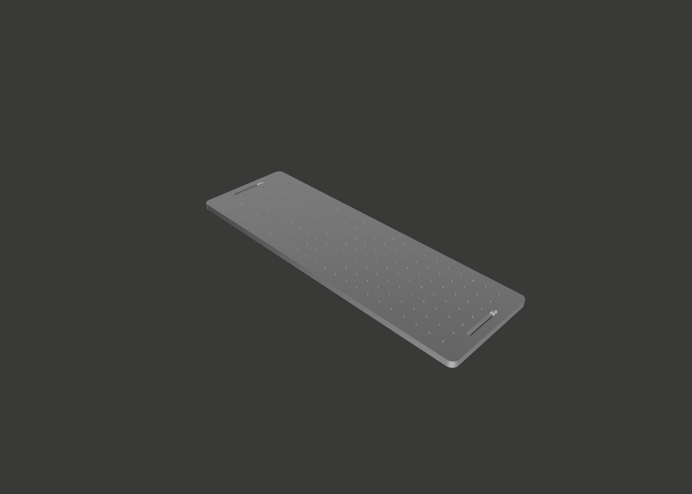

# millenium machines F.I.X.A.T.E.D

Welcome to the Millenium machines fixated project. Fixated is a list of fixtures and parts created for the Milo line of machines.

## FIXATED fixture plates  

- The FIXATED full monty

A fixture plate system designed to fit the bed of a standard sized milo V1.5 (500x160mm) and features 
hole spacings of 20mm on center intended for tapping to M5 and another set of holes also 20mm on center to accomadate M6 dowels.

- The FIXATED full monty (SLIM)

The full monty slim covers the same features as the regular full monty but only covers the workable area of a standard milo v1.5.

- The FIXATED continental breakfast 

The full monty's slim european cousin this fixture plate system designed to fit the bed of a standard sized milo V1.5 (500x160mm) and features hole spacings of 20mm on center intended for tapping to M5 unlike the full monty it does not include the holes for the M6 dowels.

- The FIXATED continental breakfast (SLIM)

The continental breakfast slim covers the same features as the regular continental breakfast but only covers the workable area of a standard milo v1.5.

For manufacturing specifications and technical drawings please see [documentation](docs/README.md).

## FIXATED Plate Clamps

The optimal way to hold your fixated plate down is to utilise these plate clamps. They can be 3d printed but for the best performance you will want to machine a set.

For manufacturing specifications and technical drawings please see [documentation](/docs/Machined%20plate%20clamps/README.md).